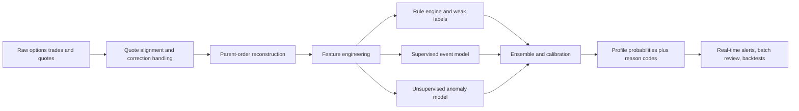

# Smart Money Options Flow Classifier Playbook

## Executive Summary

A usable options-flow classifier should start from one hard truth: there is no single “smart money” footprint. The same aggressive print can come from an informed institutional buyer, a dealer hedging inventory, a retail stampede, a facilitation auction, or a parity trade embedded in a complex order. The public tape is informative, but it is noisy, and the literature is mixed: some studies find that options volume and order imbalance predict future stock returns and volatility, while other work shows that a meaningful share of apparent pre-event options activity is speculative and retail-driven rather than informed.

The practical implication is that you should not train one monolithic `smart_money = 1` label. Train a taxonomy. First reconstruct parent events from child prints, quotes, condition codes, venue information, and Greeks. Then classify each parent event into one or more participant-style hypotheses such as directional institutional block buy, dealer hedge, professional/prop burst, retail whale chase, event-driven informed flow, volatility seller, or arbitrage desk. That hierarchy matches both the official options market structure and the academic evidence on demand pressure, volatility-information trading, dealer hedging, retail demand, and event-time option selection.

Your best baseline is an ensemble. Use rules to produce interpretable weak labels, supervised models to learn non-linear interactions, and unsupervised anomaly detection to catch new regimes. Keep the final output probabilistic and multi-label, not categorical and overconfident. That is the only sane way to handle a market where options sometimes lead stocks, but options are also noisier than equities because of wider spreads, temporary price pressure, legging, and event-driven speculation.

## Market Structure and Data Foundation

Start with public U.S. listed-options data from Options Price Reporting Authority. The OPRA specification gives you participant ID, last-sale message types, quote messages, best-bid/best-offer appendages, and end-of-day open interest. Participant IDs identify the exchange that originated the message, and OPRA quote appendages identify the exchange posting the best bid or offer. OPRA also carries important last-sale condition detail including ISO executions, auctions, crosses, multi-leg complex trades, stock-option trades, compression trades, late prints, cancels, and out-of-sequence messages. Those fields are the backbone of any classifier worth building.

Venue and structure matter because the rules explicitly allow complex and special-order handling to look different from plain single-leg urgency. The options order protection plan defines an ISO as a limit order routed together with additional ISOs to satisfy better-priced protected quotations, and it treats complex trades as a specific trade-through exception. Exchange rulebooks also define complex-order books, complex-order auctions, synthetic BBOs for strategies, and legging into simple books. In plain English: a print that looks “too aggressive” versus the simple-leg NBBO may be perfectly normal for a complex strategy or auction.

Use official strategy definitions from The Options Clearing Corporation to anchor the arbitrage and overwrite classes. OCC materials and related exchange methodology documents give canonical descriptions of covered-call or buy-write structures, put/call parity, conversions, reversals, and box spreads. Those are not trivia; they let you design deterministic detectors for some of the cleanest non-directional “smart money” profiles on the tape.

Routing data is the next layer. Public routing disclosure under U.S. Securities and Exchange Commission Rule 606 and the FINRA 606 portal can tell you where non-directed listed-options orders are routed and whether payment for order flow or other venue economics may be shaping execution. That is not a per-trade participant flag, but it becomes useful as a prior when you have broker-level logs, customer requests, or controlled execution datasets.

For quote alignment, use the latest valid NBBO snapshot at or before the trade timestamp, but maintain a correction pipeline because OPRA explicitly documents late trades, out-of-sequence trades, cancels, and sequence resets. For volatility features, derive IV, delta, gamma, and vega from a surface built from contemporaneous quotes; for variance-risk features, use an option-strip estimate of risk-neutral variance and compare it with subsequent realized variance. That is the cleanest way to separate directional demand from pure vol-selling or vol-buying pressure.

### Data sources and what each is good for

| Source | Core fields | Best use in classifier | Main limitations |
|---|---|---|---|
| OPRA time & sales / tape | last sale, condition code, exchange participant ID, contract identifiers | trade reconstruction, urgency, venue, complex/auction/special print filters | no beneficial owner, no true account class |
| OPRA quotes / NBBO | bid, ask, sizes, best-bid/best-offer appendages | aggressor-side inference, spread position, quote pressure | quote-trade desync, temporary noise |
| Vendor-normalized NBBO & trades such as products from Nasdaq | nanosecond timestamps, OPRA-derived NBBO/trade fields, appendages | production-grade replay, lower engineering friction | still usually lacks owner identity |
| Exchange rulebooks and venue specs such as Cboe Options Exchange materials | complex-order logic, auction mechanics, strategy definitions | false-positive mitigation for crosses, auctions, legging | descriptive, not participant labels |
| Open interest | end-of-day OI by contract | weak confirmation of opening flow for training and backtests | not real-time |
| Broker routing / Rule 606 | venue distribution, non-directed-routing stats, PFOF economics | priors on retail/wholesaler routing, venue fingerprints | not per-trade in public reports |
| IV surface and underlying prices | IV, skew, term structure, delta/gamma/vega, realized vol | participant-style separation, especially vol sellers, hedgers, arbs | model choice matters |
| Event calendars | earnings, M&A, dividends, corporate actions | event-driven informed-flow labeling | external datasets required |
| Broker/account/CAT-like audit data if available | account type, origin, open/close, route chain | strongest labels for retail vs professional vs institutional | usually not publicly available |

Source basis for the table: OPRA field definitions and condition codes, vendor OPRA-derived feeds, exchange complex-order rules, OCC strategy definitions, SEC Rule 606, and FINRA’s 606 reporting portal.

The core research takeaway is that the tape can contain real information. Easley, O’Hara, and Srinivas show that signed positive and negative option volume contains information about future stock prices; Pan and Poteshman show that open-buy put/call ratios predict subsequent stock returns; Ni, Pan, and Poteshman show that non-market-maker net demand for volatility predicts future realized volatility beyond implied volatility; and later price-discovery work finds that options reflect new information before stocks roughly one-quarter of the time on average, especially around information events. But equally important, other work shows strongly mixed evidence, including papers arguing that much earnings-related options activity is dominated by speculative retail trading and differences of opinion rather than pure information. Your classifier must be built around that ambiguity, not around internet folklore.

## Taxonomy of Smart Money Profiles

The table below is intentionally pragmatic. Where the market does not provide a canonical cutoff, the threshold is marked **unspecified** and I add a **seed** value in parentheses that is meant only as a starting hyperparameter. Tune every seed by symbol liquidity bucket, option price level, spread regime, and event context.

| Profile | Economic motive | Strongest tape signature | Highest-value measurable features | Suggested thresholds or ranges |
|---|---|---|---|---|
| Institutional block buyers | Directional or convexity exposure around a thesis or catalyst | Large parent order, mostly aggressive, concentrated in one strike or a tight strike cluster, expiration usually aligned with a catalyst horizon | ask-lift share, spread position, parent notional, strike concentration, DTE, absolute delta, next-day OI change, IV percentile | ask-lift share **unspecified** (seed `> 0.60`); parent notional **unspecified** (seed `>$250k` single names, `>$1m` indexes); same-strike notional share **unspecified** (seed `>0.70`) |
| Market makers hedging | Inventory and gamma risk management | Activity is most visible as reactive cross-asset flow, especially in short-dated ATM contracts and the underlying/futures, often reversing with price changes | DTE, ATM proximity, dollar gamma, hedge-link to stock/futures, intraday sign reversals, two-sided prints, quote widening | DTE `0–2` days for strongest signatures; abs(delta) **unspecified** (seed `0.35–0.65`); high dollar gamma **unspecified** (seed `>95th percentile by symbol/DTE`) |
| Prop firms / professional customers | Intraday alpha, microstructure taking, liquidity seeking, statistical edge | Rapid child-order bursts across venues or strikes, ISO/sweep-like urgency, low dwell time, often many small or medium clips rather than one giant block | inter-fill milliseconds, venue count, ISO flag, distinct strikes in burst, burst entropy, lot-size dispersion, routing pattern | official “professional customer” threshold is `>390 orders/day` if origin data exists; public burst proxy **unspecified** (seed `>=5` child prints in `<=2s`, `>=2` venues) |
| Retail whales | Leveraged speculation in attention-heavy names | Large prints by retail standards, short-dated and often OTM, heavily call-biased in favored names, rising IV, often occurs in the same contracts retail prefers generally | DTE, moneyness, call/put bias, IV shock, venue prior from routing data, concentration in high-attention symbols | DTE **unspecified** (seed `<=7` for single names, often `0DTE/1DTE` in indexes); abs(delta) **unspecified** (seed `0.10–0.35`); notional threshold is account-dependent and thus **unspecified** |
| Corporate-event informed flow | Exploit private or superior information about timing and direction of a known upcoming event; do **not** equate this with illegal insider trading | Expiration chosen to land just after the event, high leverage via OTM or near-ATM contracts, unusual pre-event volume, IV and spreads often rise before announcement | event-distance days, expiry alignment, moneyness, spread widening, IV term-structure change, OI growth, low-priced leverage preference | event window **unspecified** (seed `1–30d` before event); expiry alignment **unspecified** (seed “first listed expiry after event”); abs(delta) **unspecified** (seed `0.15–0.40` for directional calls/puts; `0.40–0.60` for straddles/strangles) |
| Volatility sellers | Harvest premium, overwrite stock, or short rich implied volatility | Prints are often on the sell side near bid or midpoint, repeated rolled positions, multi-leg short-vol structures, or covered-call / buy-write linkage to stock | signed vega, IV-minus-HV, realized-vs-implied variance spread, roll cadence, covered-call stock ratio, multi-leg flags | sell-side dominance **unspecified** (seed `>0.60` of parent contracts); IV-RV richness **unspecified** (seed z-score `>1.5`); covered-call stock/contract ratio **unspecified** (seed `80–120` shares per contract equivalent) |
| Arbitrage desks | Enforce parity, finance/carry trades, or exploit mispricings | Conversions, reversals, boxes, jelly-roll-like structures, same-size matched legs, near-zero net delta, often same expiry/paired strikes, may appear as complex trades | parity residual, matched-leg timing, same-size legs, net delta near zero, net vega near zero, complex flag, European/cash-settled box eligibility | abs(net delta) **unspecified** (seed `<0.05` of equivalent shares after scaling); parity residual **unspecified** (seed `> fees + slippage`); same-size matched legs `exact or within 5%` |

Evidence anchors for the taxonomy: signed option volume predicts future stock prices, volatility demand predicts future realized volatility, dealer hedging changes spreads and underlier trading, retail demand clusters in short-dated OTM calls and affects IV, informed traders time maturities around earnings/news, professional-customer status begins above 390 orders per day, and arbitrage/overwrite structures are formally defined by OCC and exchange methodology.

Two profiles deserve special caution. First, market-maker hedging is often better observed in the underlying than in the options tape itself; a dealer can be the passive counterparty in options and the aggressive actor in stock or futures because of delta rebalancing, especially in high-gamma short-dated regimes. Second, “corporate-event informed flow” should be treated as a market-behavior label, not as an accusation of illegal insider trading. The academic and regulatory evidence shows suspicious pre-event patterns can exist, but the public tape is not enough to prove intent or legal status.

## Feature Engineering and Weak Labeling

The right unit of analysis is almost never the raw print. It is the reconstructed parent event. Sessionize child prints by contract, side, and time gap; align them to the most recent valid quote; compute whether the parent traded at the ask, at the bid, or through a special mechanism; then aggregate size, notional, strike dispersion, expiry alignment, venue footprint, and Greeks. If you skip parent reconstruction, your classifier will overfit to child-print fragmentation and venue noise.

### Feature library

| Feature | How to compute | Data required | Suggested threshold / range |
|---|---|---|---|
| `order_side_score` | classify child print as buy if `price >= ask - eps`, sell if `price <= bid + eps`, else midpoint/unknown; aggregate parent as ask-lift share or bid-hit share | trades + contemporaneous NBBO | `eps` **unspecified** (seed `0.01` or `0.1 * spread`); buy aggression **unspecified** (seed ask-lift share `>0.60`) |
| `spread_position` | `(price - bid) / max(ask - bid, tick)` clipped to `[0,1]` | trades + NBBO | buy-like `>=0.80`, sell-like `<=0.20` |
| `inter_fill_ms` | median and max milliseconds between child prints in same parent | trades | urgent burst **unspecified** (seed median `<=500ms`); sweep-like **unspecified** (seed child gap `<=50ms`) |
| `parent_notional_usd` | `sum(size * contract_multiplier * trade_price)` over parent | trades + contract multiplier | **unspecified** (seed rank `>=99th pct` by symbol; or absolute `>$250k` single names / `>$1m` indexes) |
| `strike_concentration` | largest strike notional share within parent or same-day cluster | trades | **unspecified** (seed `>0.70`) |
| `maturity_alignment` | days from trade date to expiry; also distance from expiry to event date | contract metadata + event calendar | directional event flow often `expiry just after event`; hedge flow strongest at `0DTE/1DTE/2DTE`; exact cutoff **unspecified** |
| `abs_delta` and `dollar_gamma` | compute from IV surface and spot; scale gamma by contracts and spot | quotes + underlying + surface | event-driven directional flow often abs(delta) **unspecified** (seed `0.15–0.40`); hedge-sensitive flow often `0.35–0.65` |
| `iv_minus_hv` / `vrp_signal` | compare contemporaneous IV or synthetic risk-neutral variance with trailing HV or future RV | quotes + underlying history | **unspecified** (seed z-score `>1.5` for “rich IV”, `<-1.5` for “cheap IV`) |
| `complex_flag` | true if OPRA condition indicates multi-leg, cross, auction, stock-option, or compression trade | OPRA condition codes | exact by condition code; no threshold |
| `venue_count` and `venue_entropy` | count distinct exchanges in parent burst and entropy of prints by exchange | participant ID / exchange | **unspecified** (seed `>=2` venues in `<=1s` = urgency prior) |
| `iso_or_sweep_flag` | true if OPRA ISO condition present or if multi-venue ask-lifting occurs in one burst | trade conditions + participant ID + NBBO | ISO is deterministic when flagged; burst-sweep proxy **unspecified** |
| `routing_prior` | broker-level probability vector from Rule 606, broker execution logs, or account-specific data | Rule 606 / broker logs | public per-trade threshold is **unspecified** |
| `oi_confirmation` | `next_day_OI - prior_day_OI`, optionally scaled by burst size | open interest + trades | **unspecified** (seed `OI delta > 0` or `>=25%` of parent size) |
| `underlying_link` | stock/futures buy-sell imbalance in a short window around option parent; for buy-write detect stock buy near call sale | signed stock/futures trades + options | **unspecified** (seed `±5s` window; share/contract ratio `80–120`) |

Source basis for the feature library: OPRA quote/trade fields, OPRA condition codes, open interest, the options order protection plan, complex-order rules, variance-risk-premium construction from option prices, and academic evidence linking directional, volatility, retail, and event-time flow to specific contracts and maturities.

### Weak-label seeds for training

| Profile | Positive seed label | Hard exclusions / downweights |
|---|---|---|
| Institutional block buyer | large parent notional, ask-lift dominant, concentrated in one strike or narrow cluster, not tagged complex/auction, expiry consistent with thesis horizon, next-day OI rises | complex/auction/cross flags, parity-like matched opposite legs, obvious covered-call stock link |
| Market-maker hedge | high dollar gamma in `0DTE–2DTE` near ATM, option parent followed by opposite-direction stock/futures hedge, repeated intraday sign flips, two-sided inventory management | single giant concentrated directional bet with no underlier hedge |
| Prop / professional | many child prints fast, multiple venues, ISO or sweep-like urgency, multiple strikes or expiries, high daily order count if origin exists | one slow resting limit order, one-venue block, obvious overwrite/arbitrage |
| Retail whale | short-dated OTM call-heavy flow in retail-favored symbol, IV shock, broker/venue prior consistent with retail routing if available | complex parity structures, low-delta institutional put hedges, calm overwrite roll |
| Corporate-event informed flow | event within next `1–30d`, expiry just after event, unusual OTM directional exposure or ATM vol exposure, rising IV/spreads, OI expansion | contracts far beyond event horizon, obvious retail-meme chase, special-order cross conditions |
| Vol seller | sell-side dominant, short vega, repeated monthly roll or overwrite pattern, IV rich to HV/RV, stock buy link for covered call | strong ask-lifting call/put buys, long-vol straddles, event-aligned convexity buys |
| Arbitrage desk | same-size opposite legs, same expiry and parity-linked strikes, near-zero net delta, complex flag or matched-leg timestamps | highly concentrated one-way exposure with large residual delta |

These labels are intentionally “silver,” not “gold.” They are for weak supervision, self-training, and human review queues. Public OPRA-style data does not identify beneficial owner, open/close intent in real time, or customer/professional/institutional status directly, so hard participant labels require richer private data.

## Classifier Design and Evaluation

A strong design is a three-layer ensemble. Layer one is an interpretable rule engine that reconstructs parents, filters special prints, and emits weak labels plus reason codes. Layer two is a supervised event-level model, usually gradient-boosted trees as the baseline and a sequence model only if you truly need temporal microstructure context. Layer three is an unsupervised anomaly detector by symbol and regime to catch novel bursts that the rules and labels miss. Calibrate the final probabilities so downstream systems can set risk-sensitive thresholds instead of blindly trusting raw scores. That structure matches the mixed research evidence and the market’s obvious non-stationarity.



Evaluation should happen at the parent-event level, not the child-print level. Use macro and micro F1, precision, recall, AUROC, AUPRC, Matthews correlation, Brier score, and expected calibration error. Then add profile-specific economic validation. For directional institutional or event-driven flow, test post-signal stock return, IV change, and spread-adjusted PnL. For vol sellers, test realized-versus-implied variance, theta capture, and post-event IV compression. For arbitrage, test parity convergence net of fees and slippage. For market-maker hedges, test whether predicted hedge-linked flow lines up with same-session stock or futures rebalancing.

Backtests should be walk-forward and purged. Split by time first, then by symbol clusters or sectors if you can, and embargo around the same catalyst so nearly identical event windows do not leak into train and test. Use only information available at the event timestamp in the live feature set. End-of-day open interest can validate labels during offline training, but it must never leak into real-time scoring. Re-run batch labels after cancels, late reports, and sequence repairs. That last step is not optional; the OPRA spec explicitly says those records exist.

### Common false positives and how to kill them

| False positive | Why it happens | Mitigation |
|---|---|---|
| Aggressive buy at ask that is actually an auction or facilitation print | single-leg or complex auctions can print “aggressively” without informed urgency | downweight or exclude auction/cross/complex condition codes before directional classification |
| Print above simple-leg NBBO that is actually a complex trade | complex trades have protection exceptions and can leg or price off strategy economics | require `complex_flag = false` for simple directional labels |
| Retail frenzy mistaken for institutional conviction | retail demand is heavily concentrated in short-dated OTM calls and can move IV | layer in retail priors, attention proxies, and avoid treating short-dated OTM call bursts as automatically informed |
| Dealer re-hedging mistaken for end-user direction | dealer inventory management can create reactive stock/futures flow and two-sided options activity | use stock/futures linkage and estimated dollar gamma |
| Parity trades mistaken for “smart bullish calls” | conversions/reversals/boxes include calls, puts, and sometimes stock in matched quantities | net Greeks and parity residual checks |
| Late, canceled, or out-of-sequence prints | tape corrections can invert apparent urgency | correction-aware replay and batch relabeling |
| Wide-spread illiquid contracts | midpoint and ask/bid inference is unreliable when spreads are huge | liquidity filters, spread normalization, larger `eps`, contract-level confidence score |
| Pre-earnings speculation mistaken for information | some literature finds earnings-related options activity is mainly speculative and retail-driven | use event alignment plus cross-checks: pre-event stock returns, spreads, OI, and profile probabilities rather than raw volume alone |

This table is built directly from OPRA condition rules, exchange complex-order mechanics, retail-flow evidence, dealer-hedging evidence, and the mixed academic results on information versus speculation in options.

## Implementation and Detection Examples

For production, keep three stores: raw append-only packet or normalized message storage; a corrected trade-and-quote warehouse; and an event-level feature store keyed by parent ID. Real time should score on the best-available aligned quote state and current IV surface, while batch should replay the day after corrections and open interest land. Storage should be columnar for history and ring-buffered in memory for current-day scoring. Latency matters mostly for parent reconstruction and hedge linkage; model inference itself is cheap compared with quote alignment and surface updates.

```mermaid
timeline
    title Sample trade sequence for one inferred parent event
    09:31:02.100: NBBO 1.00 x 1.05
    09:31:02.120: 1,500 calls print at 1.05 on one venue
    09:31:02.310: 2,000 calls print at 1.05 on second venue
    09:31:02.360: 1,200 calls print at 1.06 after ask lifts
    09:31:02.900: stock/futures buy program starts
    09:31:03.400: implied vol up and spread widens
    09:31:04.000: parent burst closes and event is scored
```

### Example pseudocode

```python
from dataclasses import dataclass, field
from typing import List, Dict, Optional
import math

@dataclass
class ChildTrade:
    ts_ns: int
    underlying: str
    expiry: str
    strike: float
    cp: str
    price: float
    contracts: int
    exchange: str
    cond: str
    bid: float
    ask: float
    spot: float
    iv: Optional[float] = None
    delta: Optional[float] = None
    gamma: Optional[float] = None

@dataclass
class ParentEvent:
    children: List[ChildTrade] = field(default_factory=list)

    def add(self, t: ChildTrade) -> None:
        self.children.append(t)

    def features(self) -> Dict[str, float]:
        if not self.children:
            return {}

        prices = [c.price for c in self.children]
        sizes = [c.contracts for c in self.children]
        notionals = [c.price * c.contracts * 100.0 for c in self.children]
        spreads = [max(c.ask - c.bid, 0.01) for c in self.children]

        ask_lifts = [
            1.0 if c.price >= c.ask - min(0.01, 0.1 * (c.ask - c.bid)) else 0.0
            for c in self.children
        ]
        bid_hits = [
            1.0 if c.price <= c.bid + min(0.01, 0.1 * (c.ask - c.bid)) else 0.0
            for c in self.children
        ]
        spread_pos = [
            max(0.0, min(1.0, (c.price - c.bid) / s))
            for c, s in zip(self.children, spreads)
        ]

        ts = sorted(c.ts_ns for c in self.children)
        gaps_ms = [(ts[i] - ts[i - 1]) / 1e6 for i in range(1, len(ts))]
        gap_med_ms = sorted(gaps_ms)[len(gaps_ms) // 2] if gaps_ms else 0.0

        strike_notional: Dict[tuple, float] = {}
        venue_set = set()
        complex_flag = 0
        iso_flag = 0

        gamma_dollar = 0.0
        delta_equiv_shares = 0.0

        for c, n in zip(self.children, notionals):
            strike_notional[(c.expiry, c.strike, c.cp)] = strike_notional.get((c.expiry, c.strike, c.cp), 0.0) + n
            venue_set.add(c.exchange)
            if c.cond in set("abcdefghijklmnopqrstuvwxyz"):
                complex_flag = 1
            if c.cond == "S":
                iso_flag = 1
            if c.gamma is not None:
                gamma_dollar += c.gamma * c.contracts * 100.0 * (c.spot ** 2) * 0.01
            if c.delta is not None:
                delta_equiv_shares += c.delta * c.contracts * 100.0

        top_cluster_share = max(strike_notional.values()) / max(sum(notionals), 1.0)

        return {
            "contracts_total": float(sum(sizes)),
            "notional_total_usd": float(sum(notionals)),
            "avg_price": sum(prices) / len(prices),
            "ask_lift_share": sum(ask_lifts) / len(ask_lifts),
            "bid_hit_share": sum(bid_hits) / len(bid_hits),
            "spread_pos_mean": sum(spread_pos) / len(spread_pos),
            "inter_fill_median_ms": gap_med_ms,
            "top_strike_cluster_share": top_cluster_share,
            "venue_count": float(len(venue_set)),
            "complex_flag": float(complex_flag),
            "iso_flag": float(iso_flag),
            "gamma_dollar_per_1pct_move": gamma_dollar,
            "delta_equiv_shares": delta_equiv_shares,
        }

def same_parent(prev: ChildTrade, cur: ChildTrade, max_gap_ms: int = 2000) -> bool:
    if (cur.ts_ns - prev.ts_ns) / 1e6 > max_gap_ms:
        return False
    return (
        prev.underlying == cur.underlying
        and prev.cp == cur.cp
        and prev.expiry == cur.expiry
        and abs(prev.strike - cur.strike) < 1e-9
    )

def score_profile(x: Dict[str, float]) -> Dict[str, float]:
    # Interpretable weak-score layer. Replace with calibrated model outputs later.
    scores = {
        "institutional_block_buy": 0.0,
        "market_maker_hedge": 0.0,
        "prop_professional": 0.0,
        "retail_whale": 0.0,
        "corporate_event_informed": 0.0,
        "vol_seller": 0.0,
        "arbitrage_desk": 0.0,
    }

    if x["complex_flag"] == 0 and x["ask_lift_share"] > 0.60 and x["top_strike_cluster_share"] > 0.70:
        scores["institutional_block_buy"] += 0.6
    if x["inter_fill_median_ms"] <= 500 and x["venue_count"] >= 2:
        scores["prop_professional"] += 0.5
    if x["iso_flag"] == 1:
        scores["prop_professional"] += 0.2
    if x["complex_flag"] == 1 and abs(x["delta_equiv_shares"]) < 0.05 * max(x["contracts_total"] * 100.0, 1.0):
        scores["arbitrage_desk"] += 0.5
    if x["bid_hit_share"] > 0.60:
        scores["vol_seller"] += 0.4

    # Market-maker-hedge score benefits from separate stock/futures linkage features not shown here.
    return scores
```

### SQL schema assumption

The SQL below assumes PostgreSQL and these normalized tables:

- `option_trades(ts, trade_id, underlying, expiry, strike, cp, price, contracts, exchange, cond)`
- `option_nbbo(ts, underlying, expiry, strike, cp, bid, ask, bid_exch, ask_exch)`
- `stock_trades_signed(ts, symbol, shares, price, side_est)` where `side_est` is `1` for aggressive buy and `-1` for aggressive sell

### SQL prework: enrich options prints with the latest NBBO

```sql
CREATE MATERIALIZED VIEW enriched_option_trades AS
SELECT
    t.*,
    q.bid,
    q.ask,
    q.bid_exch,
    q.ask_exch,
    CASE
        WHEN t.price >= q.ask - LEAST(0.01, 0.10 * GREATEST(q.ask - q.bid, 0.01)) THEN  1
        WHEN t.price <= q.bid + LEAST(0.01, 0.10 * GREATEST(q.ask - q.bid, 0.01)) THEN -1
        ELSE 0
    END AS side_est,
    CASE
        WHEN q.ask > q.bid THEN (t.price - q.bid) / (q.ask - q.bid)
        ELSE NULL
    END AS spread_pos,
    (t.price * t.contracts * 100.0) AS notional_usd,
    (t.cond = 'S')::int AS iso_flag
FROM option_trades t
JOIN LATERAL (
    SELECT q.*
    FROM option_nbbo q
    WHERE q.underlying = t.underlying
      AND q.expiry     = t.expiry
      AND q.strike     = t.strike
      AND q.cp         = t.cp
      AND q.ts        <= t.ts
    ORDER BY q.ts DESC
    LIMIT 1
) q ON TRUE;
```

### SQL query: buys at or above the ask within seconds

```sql
WITH tagged AS (
    SELECT
        *,
        CASE
            WHEN LAG(ts) OVER w IS NULL THEN 1
            WHEN EXTRACT(EPOCH FROM (ts - LAG(ts) OVER w)) > 2 THEN 1
            ELSE 0
        END AS new_parent
    FROM enriched_option_trades
    WHERE side_est = 1
      AND cond NOT IN ('a','b','c','d','f','g','h','i','j','k','l','m','n','o','p','q','r','s','t','u','v')
    WINDOW w AS (
        PARTITION BY underlying, expiry, strike, cp
        ORDER BY ts
    )
),
parents AS (
    SELECT
        *,
        SUM(new_parent) OVER (
            PARTITION BY underlying, expiry, strike, cp
            ORDER BY ts
            ROWS UNBOUNDED PRECEDING
        ) AS parent_id
    FROM tagged
)
SELECT
    underlying, expiry, strike, cp, parent_id,
    MIN(ts) AS start_ts,
    MAX(ts) AS end_ts,
    SUM(contracts) AS contracts_total,
    SUM(notional_usd) AS notional_total_usd,
    AVG(spread_pos) AS mean_spread_pos,
    COUNT(*) AS child_prints
FROM parents
GROUP BY underlying, expiry, strike, cp, parent_id
HAVING SUM(notional_usd) > 250000
   AND AVG(spread_pos) >= 0.80
ORDER BY start_ts;
```

### SQL query: large notional concentrated in a single strike

```sql
WITH daily AS (
    SELECT
        DATE(ts) AS trade_date,
        underlying,
        expiry,
        strike,
        cp,
        SUM(notional_usd) AS strike_notional,
        SUM(SUM(notional_usd)) OVER (
            PARTITION BY DATE(ts), underlying
        ) AS total_notional_underlying
    FROM enriched_option_trades
    WHERE side_est = 1
    GROUP BY DATE(ts), underlying, expiry, strike, cp
)
SELECT
    trade_date,
    underlying,
    expiry,
    strike,
    cp,
    strike_notional,
    total_notional_underlying,
    strike_notional / NULLIF(total_notional_underlying, 0) AS strike_share
FROM daily
WHERE strike_notional >= 250000
  AND strike_notional / NULLIF(total_notional_underlying, 0) >= 0.70
ORDER BY trade_date, underlying, strike_share DESC;
```

### SQL query: rapid repeated buys across strikes

```sql
WITH bursts AS (
    SELECT
        *,
        CASE
            WHEN LAG(ts) OVER w IS NULL THEN 1
            WHEN EXTRACT(EPOCH FROM (ts - LAG(ts) OVER w)) > 2 THEN 1
            ELSE 0
        END AS new_burst
    FROM enriched_option_trades
    WHERE side_est = 1
      AND cond NOT IN ('a','b','c','d','f','g','h','i','j','k','l','m','n','o','p','q','r','s','t','u','v')
    WINDOW w AS (
        PARTITION BY underlying, expiry, cp
        ORDER BY ts
    )
),
clustered AS (
    SELECT
        *,
        SUM(new_burst) OVER (
            PARTITION BY underlying, expiry, cp
            ORDER BY ts
            ROWS UNBOUNDED PRECEDING
        ) AS burst_id
    FROM bursts
)
SELECT
    underlying,
    expiry,
    cp,
    burst_id,
    MIN(ts) AS start_ts,
    MAX(ts) AS end_ts,
    COUNT(*) AS child_prints,
    COUNT(DISTINCT strike) AS strikes_hit,
    COUNT(DISTINCT exchange) AS venues_hit,
    SUM(notional_usd) AS burst_notional_usd
FROM clustered
GROUP BY underlying, expiry, cp, burst_id
HAVING COUNT(DISTINCT strike) >= 3
   AND COUNT(DISTINCT exchange) >= 2
   AND SUM(notional_usd) > 250000
ORDER BY start_ts;
```

### SQL query: sweeps

```sql
SELECT
    underlying,
    expiry,
    strike,
    cp,
    MIN(ts) AS start_ts,
    MAX(ts) AS end_ts,
    COUNT(*) AS child_prints,
    COUNT(DISTINCT exchange) AS venues_hit,
    SUM(notional_usd) AS notional_total_usd,
    MAX(iso_flag) AS has_iso_flag
FROM enriched_option_trades
WHERE side_est = 1
GROUP BY underlying, expiry, strike, cp, DATE_TRUNC('second', ts)
HAVING MAX(iso_flag) = 1
    OR (
        COUNT(DISTINCT exchange) >= 2
        AND COUNT(*) >= 3
        AND SUM(notional_usd) > 150000
    )
ORDER BY start_ts;
```

### SQL query: probabilistic buy-write / covered-call indicator

```sql
WITH option_sales AS (
    SELECT
        ts,
        underlying,
        expiry,
        strike,
        cp,
        contracts,
        notional_usd
    FROM enriched_option_trades
    WHERE cp = 'C'
      AND side_est = -1
      AND cond NOT IN ('a','b','c','d','f','g','h','i','j','k','l','m','n','o','p','q','r','s','t','u','v')
),
paired AS (
    SELECT
        o.ts AS option_ts,
        s.ts AS stock_ts,
        o.underlying,
        o.expiry,
        o.strike,
        o.contracts,
        s.shares,
        ABS(s.shares - o.contracts * 100) AS ratio_error
    FROM option_sales o
    JOIN stock_trades_signed s
      ON s.symbol = o.underlying
     AND s.side_est = 1
     AND s.ts BETWEEN o.ts - INTERVAL '5 seconds' AND o.ts + INTERVAL '5 seconds'
)
SELECT
    option_ts,
    stock_ts,
    underlying,
    expiry,
    strike,
    contracts,
    shares,
    ratio_error
FROM paired
WHERE ratio_error <= contracts * 20
ORDER BY option_ts;
```

These SQL patterns are deliberately conservative. They are best used to populate candidate event sets for downstream scoring, not as final labels by themselves. That is especially true for sweeps, retail whales, and buy-write detection, where account-level or route-level data can dramatically improve precision.

## Open Questions and Limitations

The biggest limitation is identity. Public OPRA-style options data gives venue, timestamps, quotes, trade conditions, and open interest, but not the beneficial owner, true account class, or reliable open/close intent in real time. Exchange and broker systems may carry professional/customer origin codes or route-chain data, but the public tape generally does not. That means participant-style labels from public data are inferential, not definitive.

The second limitation is that the literature is not unanimous. Some papers find strong informational content in options flow and meaningful options-led price discovery; other papers find that pre-earnings options activity is often speculative and retail-dominated. Treat that disagreement as a feature, not a bug: it is exactly why your production system should output calibrated probabilities, reason codes, and low-confidence abstentions instead of pretending every urgent call buy is “smart money.”

The last limitation is regime drift. The SEC’s recent options market-structure work and the newer 0DTE literature both show that short-dated and expiration-day activity has become a much larger share of the market, especially in index products and select equities. Thresholds that worked before widespread 0DTE activity can age badly. Refit by liquidity regime, by DTE bucket, and by event context, or the model will quietly rot.
