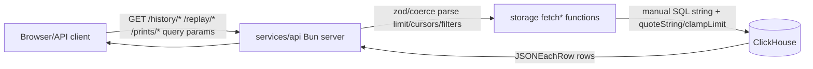
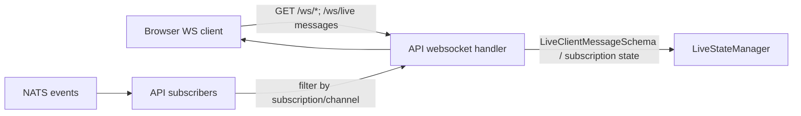
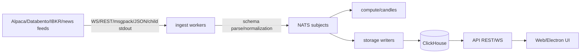
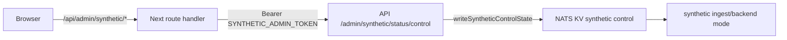
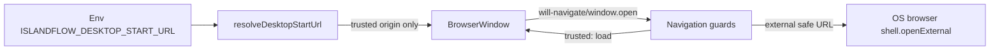
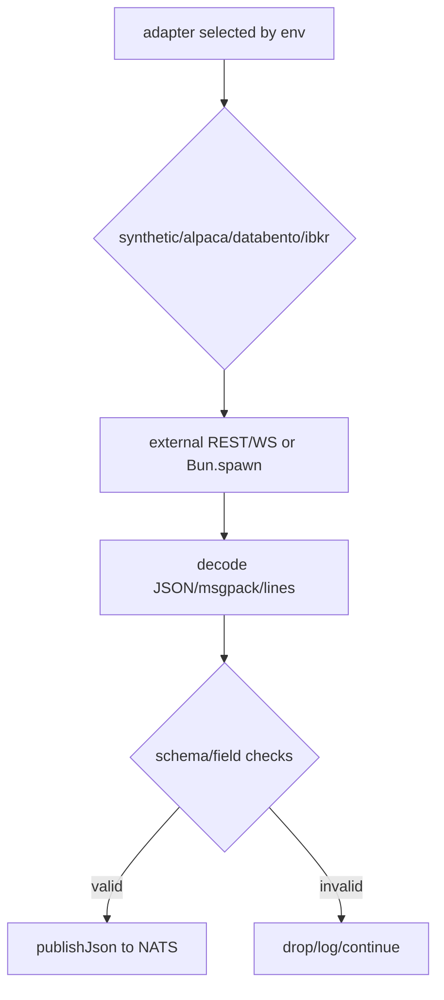
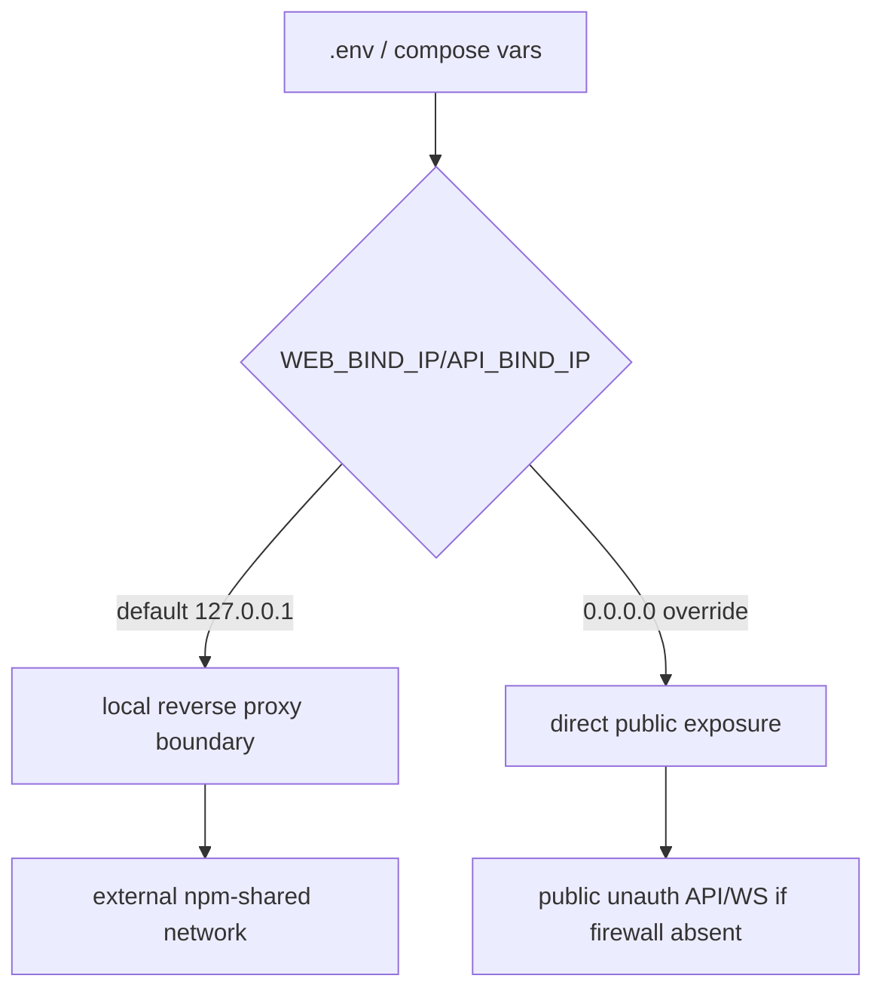
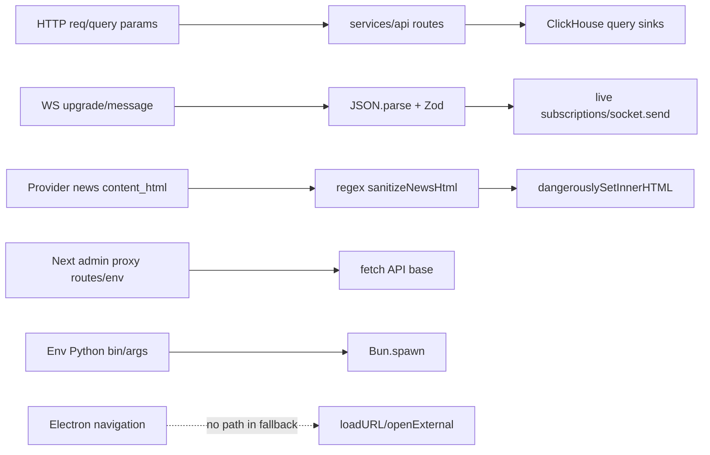
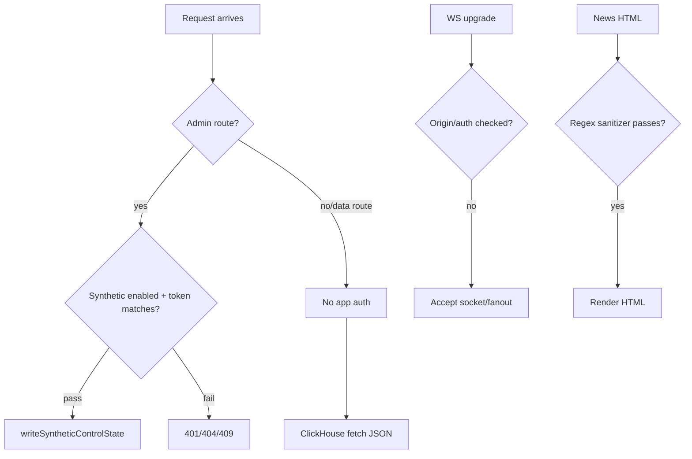

# Islandflow Phase 3 Architecture & Threat Model KB

Generated for Stage 03 `/piolium-deep` on 2026-05-27. Evidence: `README.md`, `package.json`, `services/api/src/index.ts`, `packages/storage/src/clickhouse.ts`, `services/ingest-*`, `packages/bus`, `apps/web`, `apps/desktop`, and `deployment/docker/docker-compose.yml`.

## Project Classification

### Project Type
- **Web app**: `apps/web` is a Next.js 16 UI with public pages (`/`, `/tape`, `/signals`, `/charts`, `/news`, `/options`, `/replay`) and Next route handlers for synthetic-admin proxying.
- **API / WebSocket gateway**: `services/api` is a Bun HTTP server exposing REST history/live/replay endpoints and many WebSocket channels.
- **Workers / stream processors**: `services/ingest-options`, `services/ingest-equities`, `services/ingest-news`, `services/compute`, `services/candles`, `services/replay`, `services/refdata`.
- **Desktop app**: `apps/desktop` is an Electron wrapper around the hosted/local web app.
- **Internal libraries**: `packages/types`, `packages/storage`, `packages/bus`, `packages/config`, `packages/observability`.
- **Deployment/CI tooling**: Docker Compose VPS deployment, Bun scripts, Forgejo/GitHub Actions docs/workflows.

Purpose: personal-use, event-sourced market microstructure research platform that ingests external market/news feeds, normalizes/publishes events over NATS/JetStream, persists to ClickHouse/Redis, computes derived flow/smart-money artifacts, and exposes live/replay/history through REST and WebSockets.

## Architecture Model

### Components
| Component | Key files | Role | Security relevance |
|---|---|---|---|
| Next.js web | `apps/web/app/**`, `apps/web/app/api/admin/synthetic/**` | UI + admin proxy | Browser input, rendering news/market data, admin proxy token forwarding |
| API gateway | `services/api/src/index.ts` | Bun REST/WebSocket server | Main network boundary; auth only for synthetic admin; query params to ClickHouse; WS fanout/subscription handling |
| Storage | `packages/storage/src/clickhouse.ts` | ClickHouse schema, insert/fetch query builders | SQL string construction, cursor pagination, record normalization |
| Bus | `packages/bus/src/**` | NATS/JetStream streams, subjects, KV synthetic control | Internal message integrity boundary; subject abuse/replay risks |
| Ingest options | `services/ingest-options/src/**`, `py/*` | Alpaca ws/rest, Databento/IBKR Python sidecars, msgpack/json parsing | Untrusted third-party feed data and child-process stdout enter system |
| Ingest equities/news | `services/ingest-equities/src/**`, `services/ingest-news/src/index.ts` | Alpaca feed ingestion | WebSocket/REST parsing, news HTML/content propagation |
| Compute/candles/replay | `services/compute/src/**`, `services/candles/src/**`, `services/replay/src/index.ts` | Derived events and replay | Trusts NATS/ClickHouse inputs; can amplify poisoned data |
| Electron shell | `apps/desktop/src/main.ts`, `apps/desktop/src/security.ts` | Hosted/local app wrapper | Origin/navigation/sandbox boundary; env-controlled start URL |
| Infra | `deployment/docker/docker-compose.yml` | Web, API, NATS, ClickHouse, Redis | Bind addresses, unauthenticated internal services, secrets in env |

### Trust Boundaries
1. **Internet/browser -> Next.js web/API**: HTTP and WebSocket requests. Public API appears largely unauthenticated except synthetic admin endpoints.
2. **Next.js admin proxy -> API synthetic admin**: `apps/web/app/api/admin/synthetic/shared.ts` forwards `Authorization: Bearer ${SYNTHETIC_ADMIN_TOKEN}` to `NEXT_PUBLIC_API_URL`; feature gated by `NEXT_PUBLIC_SYNTHETIC_ADMIN=1`.
3. **External market/news providers -> ingest workers**: Alpaca REST/WS, Databento replay, IBKR bridge; data is untrusted until parsed/validated by zod/shared schemas.
4. **Python child processes -> TypeScript ingest**: `Bun.spawn` stdout JSON lines in Databento/IBKR adapters are untrusted local-process output and a command/argument construction boundary.
5. **Services -> NATS/JetStream**: internal event bus subjects determine which events reach compute/storage/API. No per-subject auth visible in compose (`nats -js -sd /data`).
6. **Services -> ClickHouse/Redis**: storage/cache boundary; query strings are manually built; Redis hot cache can affect live UI state.
7. **Electron shell -> remote/local web app -> external links**: trusted origins hardcoded; navigation guards route untrusted URLs to OS browser via `shell.openExternal`.
8. **Deployment edge/proxy -> containers**: Compose binds web/API to `127.0.0.1` by default and joins an external `npm-shared` network for reverse proxy. Security depends on edge routing and env overrides.

## DFD/CFD Slices

### DFD-1: Public API query params to ClickHouse history/replay

Risk: SQL injection if any string reaches query builder without `quoteString`; DoS via expensive ranges/large limits; data exposure because endpoints are unauthenticated.

### DFD-2: WebSocket live fanout/subscription filtering

Risk: unauthenticated streaming of potentially valuable feed/derived data; WS resource exhaustion; subscription filter bypass or malformed message DoS.

### DFD-3: External feeds to NATS/ClickHouse/UI

Risk: poisoned feed messages, malformed binary/JSON DoS, HTML/script content in news, bogus symbols/traces polluting derived analytics and UI.

### DFD-4: Synthetic admin control

Risk: token leakage/misconfiguration; SSRF-like proxying if `NEXT_PUBLIC_API_URL` is attacker-controlled; admin state changes control synthetic market behavior.

### DFD-5: Electron navigation

Risk: origin allowlist mistakes, openExternal abuse, remote content compromise; controls include sandbox, context isolation, no nodeIntegration, disabled permission requests.

### CFD-1: Request routing/auth decision in API
```mermaid
flowchart TD
  A[Bun fetch(req)] --> B{path/method}
  B -->|/health| Z[public ok]
  B -->|/admin/synthetic/*| C[authenticateSyntheticAdminRequest]
  C -->|fail| D[401/403]
  C -->|pass| E[status/control KV]
  B -->|all market/history/replay/ws paths| F[public handler no auth]
  F --> G[parse params -> storage/WS]
```
Security-critical decision: only synthetic admin is protected; all other handlers rely on deployment/network exposure for access control.

### CFD-2: Ingest validation/control flow

Security-critical decision: schema parsing and field bounds decide whether untrusted external data becomes authoritative event stream.

### CFD-3: Deployment exposure

Security-critical decision: production auth depends heavily on bind IP/reverse proxy/firewall settings.

## Attack Surface

### Attacker-controlled sources
- HTTP paths/query/body to `services/api` REST endpoints: `/prints/options`, `/nbbo/options`, `/prints/equities`, `/prints/equities/range`, `/quotes/equities`, `/candles/equities`, `/joins/equities`, `/dark/inferred`, `/flow/*`, `/news`, `/history/*`, `/replay/*`, `/lookup/options-support`, `/*/by-*`, `/flow/alerts/:trace/context`.
- WebSocket connections/messages to `/ws/options`, `/ws/options-nbbo`, `/ws/equities`, `/ws/equity-candles`, `/ws/equity-quotes`, `/ws/equity-joins`, `/ws/inferred-dark`, `/ws/flow`, `/ws/classifier-hits`, `/ws/smart-money`, `/ws/alerts`, `/ws/live`.
- Next.js route handlers `/api/admin/synthetic/status` and `/api/admin/synthetic/control` when admin feature enabled.
- Market/news provider payloads from Alpaca REST/WS, Databento replay output, IBKR bridge output.
- Environment variables: service URLs, bind IPs, tokens/API keys, Python binary path, adapter selection, Electron start URL.
- NATS messages/KV state if any service or network peer can publish.
- ClickHouse/Redis contents if storage is compromised or seeded with malicious data.
- CI/deploy script inputs: branch names, PR refs, env secrets, deployment hosts.

### High-value sinks
- ClickHouse query execution in `packages/storage/src/clickhouse.ts`.
- NATS publish/subscribe/KV in `packages/bus/src/**` and service consumers.
- Redis hot cache in `services/api/src/live.ts`/candles.
- Browser DOM rendering in `apps/web`, especially news `content_html`, headlines, URLs, explanations JSON.
- Electron `shell.openExternal` and `BrowserWindow.loadURL`.
- `Bun.spawn` in Databento/IBKR adapters and deployment scripts invoking shell/ssh/docker.
- Logs/metrics containing URLs, provider errors, trace IDs, possibly secrets if not redacted.

## Framework Contracts and Hidden Control Channels

- **Bun server routing**: `services/api/src/index.ts` uses manual `if` routing. Path normalization, percent-decoding, and regex routes (`/flow/packets/:id`, `/flow/alerts/:trace/context`) are security-sensitive.
- **Next.js route handlers**: `apps/web/app/api/admin/synthetic/**` are forced dynamic and proxy to the API. Security depends on feature env and server-side `SYNTHETIC_ADMIN_TOKEN`; `NEXT_PUBLIC_API_URL` is a hidden control channel for target API base.
- **Next.js public env**: variables prefixed `NEXT_PUBLIC_*` are exposed to clients. Do not place secrets there. `NEXT_PUBLIC_API_URL` controls browser/API reachability and admin proxy target base in server code.
- **Proxy/bind assumptions**: Compose defaults `WEB_BIND_IP` and `API_BIND_IP` to `127.0.0.1`; external access likely via reverse proxy on `npm-shared`. If overridden to `0.0.0.0`, unauthenticated API/WS become directly reachable.
- **Internal services unauthenticated by default**: NATS, ClickHouse, Redis compose definitions do not show credentials/TLS. The Docker network is an implicit trust boundary.
- **Header contracts**: Synthetic admin uses `Authorization: Bearer`; no other route-level auth headers observed. If a reverse proxy injects auth headers, handlers do not re-check them.
- **WebSocket contracts**: Bun `server.upgrade` accepts based on path only; no Origin/auth check observed. `/ws/live` message schema is the main control.
- **Runtime modes**: Synthetic/admin behavior depends on `SYNTHETIC_CONTROL_ENABLED`, `SYNTHETIC_ADMIN_TOKEN`, `NEXT_PUBLIC_SYNTHETIC_ADMIN`, adapter envs. API deliver policy and consumer reset affect stream replay behavior.
- **Electron contracts**: Trust is origin-based (`flow.deltaisland.io`, `127.0.0.1:3000`, `localhost:3000`); sandbox/contextIsolation/webSecurity are enabled; permission prompts denied; external URLs opened only when source is trusted.
- **Storage escaping contract**: ClickHouse string safety depends on local `quoteString`, `buildStringList`, `clamp*`, and typed table constants. Any future query builder bypassing these helpers is high risk.

## Threat Model

### Assets
- Alpaca/Databento/IBKR API credentials and NATS/ClickHouse/Redis URLs.
- Market/news data and derived smart-money alerts/flow packets (proprietary research value).
- Integrity of event stream, replay history, and classifier outputs.
- Availability of live API, WS fanout, NATS JetStream, ClickHouse, Redis.
- Admin synthetic-control state.
- Desktop user environment (external URL opening/browser trust).
- Deployment secrets and CI credentials.

### Threat actors
- Anonymous internet clients if web/API are exposed through reverse proxy or bind-IP override.
- Malicious/compromised market data provider, websocket MITM where TLS/config is weakened, or malformed feed data.
- Network peer/container on Docker shared/default networks.
- Operator/local attacker who can modify env vars or Python binary paths.
- Malicious webpage/content rendered in news/web UI, or compromised trusted origin in Electron.
- Supply-chain attacker via npm/Bun/Python dependencies or CI workflow changes.

### Abuse paths and priorities
| Threat | Boundary | Impact | Likelihood | Priority | Existing controls | Review focus |
|---|---|---:|---:|---:|---|---|
| Unauthenticated REST/WS data extraction or scraping | Internet -> API | Med/High | Med if exposed | High | Bind defaults to localhost | Confirm intended auth; add API auth/rate limits/Origin checks |
| Synthetic admin token bypass/leak/misproxy | Browser/Next -> API admin | Med | Med | High | Bearer token, feature flag | Verify `authenticateSyntheticAdminRequest`, proxy URL allowlist, no token in client bundle/logs |
| ClickHouse injection or expensive query DoS | HTTP params -> storage | High | Med | High | zod, clamp, `quoteString` | Custom SAST for string SQL helpers and unbounded ranges |
| Poisoned feed data corrupts analytics/UI | Provider -> ingest -> NATS/UI | High integrity | Med | High | schemas, field parsing | Validate schemas, size limits, HTML sanitization, anomaly handling |
| NATS/Redis/ClickHouse lateral abuse from network peer | Docker/shared network -> infra | High | Low/Med | High | localhost port binds for web/API only | Add service credentials/TLS/ACLs; network isolation |
| WebSocket resource exhaustion | Internet -> API WS | Med/High availability | Med | High | schema parse for live messages | Connection/message limits, heartbeat, per-IP quotas |
| Electron navigation/openExternal abuse | Web content -> desktop shell | High local user impact | Low/Med | Medium | origin allowlist, sandbox, no nodeIntegration | Verify external URL schemes, downloads, CSP |
| XSS via news/content or explanation rendering | Feed/API -> web DOM | High if same origin admin token/proxy | Med | High | news summary escaping fallback | Audit `dangerouslySetInnerHTML`, URL rendering, CSP |
| Child-process command/path misuse | Env -> Bun.spawn Python | Med/High | Low/Med | Medium | args array, script path constant | Validate `pythonBin`, avoid shell, handle stdout size |
| CI/deploy secret leakage or command injection | PR/env -> scripts/workflows | High | Low/Med | Medium | limited visible workflows | Audit deploy scripts and Forgejo workflow triggers |

### Recommended controls for later phases
- Treat API/WS as public unless proven behind authenticated reverse proxy; require handler-level auth for non-public data and admin controls.
- Add Origin/token checks and connection/message rate limits to WS endpoints.
- Centralize ClickHouse query construction; prefer parameterized ClickHouse client support if available.
- Sanitize or strip provider HTML before storage/rendering; add CSP in Next app.
- Add NATS/Redis/ClickHouse credentials/ACLs/TLS or restrict network access; do not rely on Docker network trust.
- Harden admin proxy with strict API base allowlist and server-only env names for secrets.

## Domain Attack Research

Identified domains: HTTP/Next.js, WebSocket, Electron, NATS/JetStream message bus, ClickHouse SQL/query construction, Redis cache, external market-data ingestion/parsing (JSON/msgpack), subprocess execution, Docker/deployment/CI, browser rendering/XSS. Mode B applies (security-sensitive dependencies as consumers). Mode C applies (HTTP/WS, SQL, Redis, message queues, Electron, parsing, subprocess, containers/CI). Mode A is not primary because Islandflow is not distributed as a public library/protocol, though internal package API sharp edges matter.

### Domain: HTTP API / Next.js / Bun routing
**Identified via:** `services/api` manual HTTP routing, `apps/web` Next.js app and route handlers, Next advisory history.

| Attack | Description | Detection strategy | Relevance |
|---|---|---|---|
| Auth bypass / missing handler auth | Public routes unintentionally expose data/control | Find route handlers without auth checks; diff public route inventory | High |
| Path/matcher confusion | Encoded paths/trailing slashes bypass manual checks/proxy rules | Test encoded path variants and reverse proxy rewrites | Med |
| SSRF/open proxy via admin proxy | Server fetches attacker-controlled base/path | Track `new URL(path, NEXT_PUBLIC_API_URL)` and env controls | Med |
| Cache poisoning | Host/forwarded headers or Next caching leak dynamic data | Review caching headers, `dynamic`, reverse proxy config | Low/Med |

Custom SAST targets: route handlers in `services/api/src/index.ts` and `apps/web/app/api/**` lacking auth; `fetch(new URL(... env ...))`; use of `req.headers`/`Host`/`X-Forwarded-*`; public route changes. Manual checklist: confirm intended public endpoints; fuzz paths; enforce auth and rate limits. Research sources: advisory summary, wooyun-legacy web methodology, last30days/web-search class knowledge.

### Domain: WebSocket
| Attack | Description | Detection strategy | Relevance |
|---|---|---|---|
| Unauthenticated data streaming | Any client subscribes to feed/alerts | Enumerate `/ws/*` upgrades without auth/origin checks | High |
| Resource exhaustion | Many connections/messages or huge frames | Look for max payload, conn limits, heartbeat | High |
| Subscription filter abuse | Malformed filters cause broad fanout or CPU use | Validate `LiveClientMessageSchema`, filter matching paths | Med |

Custom SAST: `serverRef.upgrade`, `websocket.message`, `JSON.parse`, zod parse error loops, broadcast loops. Manual: origin/auth tests; slow-client behavior; payload size tests.

### Domain: ClickHouse SQL / query construction
| Attack | Description | Detection strategy | Relevance |
|---|---|---|---|
| SQL injection | Manual string interpolation misses escaping | Taint HTTP params to `client.query({query})`; require `quoteString/clamp*` | High |
| Query DoS | wide time ranges/high cardinality IN/LIKE/position | Find unbounded arrays/ranges and expensive predicates | High |
| Data exfiltration | unauth history/replay endpoints dump proprietary data | Route inventory + auth absence | High |

Custom SAST: RemoteFlowSource query params/body -> `query:` template literals in `packages/storage`; array length to `IN`/OR predicates; limits > configured max. Manual: test quotes/unicode/null bytes; verify max IDs and ranges.

### Domain: NATS/JetStream message bus
| Attack | Description | Detection strategy | Relevance |
|---|---|---|---|
| Subject spoofing | Network peer publishes fake market/admin events | Review connect options, credentials, subject ACLs | High |
| Replay/consumer confusion | Durable policy reset replays stale data as live | Trace `API_DELIVER_POLICY`, replay service controls | Med |
| KV control tampering | Synthetic control state modified by unauthorized peer | Review KV bucket ACL and admin endpoints | High |

Custom SAST: `publishJson`, `subscribeJson`, `writeSyntheticControlState`, unvalidated payloads. Manual: verify NATS auth/TLS in prod, subject permissions, event schemas.

### Domain: External feed parsing (JSON/msgpack/news HTML)
| Attack | Description | Detection strategy | Relevance |
|---|---|---|---|
| Parser/resource DoS | Large JSON/msgpack/websocket frames exhaust memory/CPU | Locate decode/JSON.parse without size/time bounds | High |
| Schema confusion | Partial provider payload becomes valid incorrect event | Compare zod schemas and adapter field defaults | Med |
| Stored XSS via news HTML | Provider `content` stored/rendered as HTML | Trace `content_html` to React render sinks | High |

Custom SAST: `decode`, `JSON.parse`, `new TextDecoder`, `content_html`, `dangerouslySetInnerHTML`, URLs. Manual: malformed provider fixtures; max message sizes; sanitize HTML.

### Domain: Electron desktop
| Attack | Description | Detection strategy | Relevance |
|---|---|---|---|
| Navigation escape | Untrusted page loaded in privileged shell | Check `loadURL`, origin allowlists, redirects | Med |
| openExternal abuse | Custom schemes/file URLs launched | Verify only http/https external URLs | Med |
| Node integration/IPC abuse | Web content gains local code exec | Check BrowserWindow preferences/preload/IPC | Low currently |

Custom SAST: `shell.openExternal`, `loadURL`, `setWindowOpenHandler`, `will-navigate`, BrowserWindow prefs. Manual: redirect chains, punycode/origin tests, CSP/download handling.

### Domain: Redis/cache
| Attack | Description | Detection strategy | Relevance |
|---|---|---|---|
| Cache poisoning | Malicious internal publisher/data seeds hot live state | Trace key construction and schema validation | Med |
| Availability DoS | huge values/keys or no TTL memory growth | Review `set`/`lpush`/TTL use | Med |
| Unauthorized access | Redis default no password in compose | Deployment config review | High internal |

Custom SAST: Redis key builders with attacker input, missing TTL, `JSON.parse` of cache values.

### Domain: Subprocess / Python sidecars
| Attack | Description | Detection strategy | Relevance |
|---|---|---|---|
| Command injection/path hijack | Env-controlled binary/args execute attacker program | Ensure no shell; validate `pythonBin`; constant script paths | Med |
| stdout parsing DoS | Child emits unbounded line/JSON | Limit line length and restart loops | Med |
| Secret leakage | API keys in args/env/logs | Review spawned args and stderr logging | Low/Med |

Custom SAST: `Bun.spawn`, env-derived args, `stderr: inherit`, readLines buffer growth.

### Domain: Docker/deployment/CI supply chain
| Attack | Description | Detection strategy | Relevance |
|---|---|---|---|
| Insecure bind/exposure | API/NATS/ClickHouse/Redis reachable publicly | Parse compose ports/networks/env overrides | High |
| Secret leakage in deploy scripts | Tokens printed or sent to PR contexts | Review workflow triggers/scripts | Med |
| Dependency takeover/CVE | npm/Python base images/deps vulnerable | Dependency and image scanning | Med |

Custom SAST: workflows with untrusted PR + secrets, deploy scripts shell interpolation, Docker `ports` to `0.0.0.0`, no auth configs.

## Phase 4 CodeQL Extraction Targets

| Slice | Source type | Source | Sink kind | Sink |
|---|---|---|---|---|
| DFD-1 API params -> ClickHouse | RemoteFlowSource | URL search params/path/body in `services/api/src/index.ts` | sql-execution | `client.query({ query })` in `packages/storage/src/clickhouse.ts` |
| DFD-2 WS messages -> subscriptions/fanout | RemoteFlowSource | WebSocket `message`, path upgrade | deserialization / resource exhaustion | `LiveClientMessageSchema.parse`, JSON parse, broadcast/send loops |
| DFD-3 feeds -> NATS/storage/UI | RemoteFlowSource | WebSocket/REST provider messages, child stdout | deserialization / code/data injection | `JSON.parse`, msgpack `decode`, `publishJson`, `content_html` render sinks |
| DFD-4 admin proxy/control | RemoteFlowSource + EnvironmentVariable | Next request body; `NEXT_PUBLIC_API_URL`, `SYNTHETIC_ADMIN_TOKEN` | http-request / authz decision | `fetch(url.toString())`, `writeSyntheticControlState` |
| DFD-5 Electron navigation | EnvironmentVariable + RemoteFlowSource | `ISLANDFLOW_DESKTOP_START_URL`, page navigation/window.open URL | http-request / code-execution-adjacent | `BrowserWindow.loadURL`, `shell.openExternal` |
| Python sidecars | EnvironmentVariable | `DATABENTO_PYTHON_BIN`/`IBKR_*` env args | command-execution | `Bun.spawn` |
| Redis live state | RemoteFlowSource | NATS events, API filters | cache/data poisoning | Redis client methods, JSON cache serialization |

## Spec Gap Candidates

No formal RFC/spec commitments are declared. De facto contracts to check in Phase 9:
- HTTP/1.1 and WebSocket behavior (Bun server, `ws` clients).
- OCC option symbol parsing and market-data provider contracts (Alpaca, Databento, IBKR).
- NATS/JetStream subject and durable consumer semantics.
- ClickHouse SQL escaping/string literal semantics.
- Electron security model for sandbox/context isolation/navigation.

## Coverage Gaps

- Production reverse proxy configuration is not present; API exposure/auth assumptions must be validated from deployment host.
- Full `services/api/src/index.ts` is large; later phases should extract route inventory mechanically and test every route.
- UI rendering sinks (`apps/web/app/**`) require deeper review for `dangerouslySetInnerHTML`, external links, and CSP.
- NATS/ClickHouse/Redis production credentials/TLS/ACLs are not visible in compose; if configured outside repo, collect them.
- Rate limiting is not apparent for REST/WS; availability risk remains unquantified.
- CI canonical path in README references `.forgejo/workflows`, while `.github/workflows` also exists; audit both.
- Domain research used repository/advisory evidence and built-in playbook knowledge; live web/MCP research was not available in this runtime.


## Static Analysis Summary

Stage 04 prioritized `piolium/attack-surface/candidates-summary.md` and `candidates.jsonl`, especially high-score hidden-control-channel, WebSocket, SQL/query, SSRF, and unsafe HTML candidates. `codeql` and `semgrep` were checked before scanning but were unavailable on PATH, so the run used the required fallback (`grep` + `read`) rather than fabricated scan results. Semgrep Pro could not be executed because the CLI was missing; the fallback reason is documented here, and transient `piolium/semgrep-res/` was removed during cleanup.

Artifacts produced:
- `piolium/attack-surface/source-sink-flows-all-severities.md`
- Structural fallback JSON/SARIF under `piolium/codeql-artifacts/`
- Custom placeholders/rules under `piolium/codeql-queries/` and `piolium/semgrep-rules/`
- Draft findings: `p4-001`, `p4-002`, `p4-003` (cap 30 respected)

Built-in CodeQL suites run: none (`codeql` unavailable). Built-in Semgrep rulesets run: none (`semgrep` unavailable). Custom Semgrep rule file was authored but not executed by Semgrep; manual grep/read validation matched the risky instances.

## CodeQL Structural Analysis

CodeQL database build/extraction was skipped because the `codeql` binary was not installed on PATH. Fallback structural extraction still populated the mandatory files for downstream phases:

- Entry points: 7 (`piolium/codeql-artifacts/entry-points.json`)
- Sinks: 8 (`piolium/codeql-artifacts/sinks.json`)
- Reachable slices: 5 of 7 (`piolium/codeql-artifacts/call-graph-slices.json`)

### Machine-Generated DFD Diagram



### Machine-Generated CFD Diagram



Notable entry points not fully represented in Phase 3 DFD slices: client-side `window.location.host` API/WS selection and response `content-type` robustness checks. Notable sinks mapping to high-risk flows: `dangerouslySetInnerHTML`, WebSocket `socket.send`, and ClickHouse `client.query`.

## SAST Enrichment

| Finding | Classification | Attacker Control | Boundary | CodeQL Reachability | Verdict |
|---------|---------------|-----------------|----------|-------------------|---------|
| p4-001 stored-xss-news-html-regex-sanitizer | security | upstream news provider / bus publisher controls `content_html` | external feed -> browser DOM | reachable (fallback slice DFD-3) | keep |
| p4-002 unauthenticated-websocket-market-data-streams | security | remote client controls WS upgrade/messages | internet/proxy -> API live streams | reachable (fallback slice DFD-2) | keep |
| p4-003 public-api-exposes-queryable-market-history | security | remote client controls HTTP params if API exposed | internet/proxy -> ClickHouse-backed data API | reachable (fallback slice DFD-1) | keep |
| admin-proxy-env-base-url-fetch | env/tooling/admin-only | deployment env controls `NEXT_PUBLIC_API_URL`; route path fixed | server env -> outbound fetch | reachable (fallback slice DFD-4) | drop as draft; monitor config |
| Python sidecar Bun.spawn | env/tooling/admin-only | env/config controls python binary/args | local service config -> subprocess | reachable (fallback Python sidecars) | drop |
| test secret literals | correctness/env | source-controlled tests | none | no-slice | drop |
| static redirects | correctness | no user-controlled URL | none | no-slice | drop |

## Spec Gap Analysis

### Gap: Root Docker Compose publishes unauthenticated ClickHouse, Redis, and NATS control planes

- **Contract**: Docker deployment/internal-service contract for infrastructure dependencies (ClickHouse, Redis, NATS/JetStream) should keep data/control planes internal unless credentials/TLS/ACLs are configured.
- **Security Assumption**: Application services treat ClickHouse, Redis, and NATS as trusted internal dependencies; API-layer validation/auth is not re-applied to direct database, cache, or message-bus clients.
- **Code Path**: `docker-compose.yml:1` — root compose publishes infrastructure ports; `deployment/docker/docker-compose.yml:120` — production compose keeps those services internal-only by omitting host `ports`.
- **Gap Type**: framework-contract | hidden-control-channel | proxy-trust | runtime-mode
- **Attack Vector**: A network attacker reaches the host-published service ports, publishes forged NATS messages, tampers with Redis state, or queries/modifies ClickHouse directly.
- **Exploit Conditions**: Root compose is used on a network-reachable host and host firewall does not block `8123`, `9000`, `6379`, `4222`, or `8222`.
- **Impact**: Data confidentiality/integrity compromise and bypass of API-layer controls for market history, live state, and event streams.
- **Severity**: HIGH
- **Evidence**: Root compose maps `8123:8123`, `9000:9000`, `6379:6379`, `4222:4222`, and `8222:8222`; production compose defines the same services without host `ports`.


## Authorization Audit

- Public routes matrix: `piolium/attack-surface/public-routes-authz-matrix.md`
- Public/network operations reviewed: 17 matrix rows covering API REST groups, API WebSocket groups, Next public pages, and Next synthetic-admin proxy routes.
- Frameworks covered: Bun manual routing/WebSocket upgrade, Next.js route handlers/file routes.
- Middleware/proxy-derived identity reviewed: backend synthetic bearer token, `x-synthetic-admin-token`, Next admin proxy token injection, bind/reverse-proxy exposure assumptions, WebSocket path-only upgrades.
- Drafts filed: 1 (`authz-missing-guard`): `piolium/findings-draft/p5-001-public-next-admin-proxy-confers-synthetic-admin.md`.
- Remaining review targets: unauthenticated market-data REST/history/replay/WebSocket surfaces are currently treated as intended-public/read-only, but should be chamber-reviewed against product policy because exposure depends on reverse proxy/bind settings and data may have proprietary value.

## State & Concurrency Audit

- State-holding entities catalogued: 8
- Concurrency primitives observed: JetStream manual ack/explicit ack; NATS KV for synthetic control. No language locks, DB transactions, SELECT FOR UPDATE, advisory locks, or Redis/distributed locks observed.
- Idempotency infrastructure: partial/in-memory only (`recentStructureEmits`, live/UI dedupe); no durable processed-event/idempotency store for JetStream consumers.
- Drafts filed: 2 (idempotency: 1, stale-read: 1)

## Cross-Service Taint Propagation

- Services analysed: 8
- Edges stitched: 15 (1 http, 0 grpc, 13 queue, 1 db-write, 0 file)
- Coverage gaps: provider-only HTTP calls excluded; raw `options.prints` has no in-repo consumer identified; NATS subject identity depends on deployment controls — see `piolium/attack-surface/cross-service-edges.md`
- Drafts filed: 1 (`queue-source-auth`: 1)
